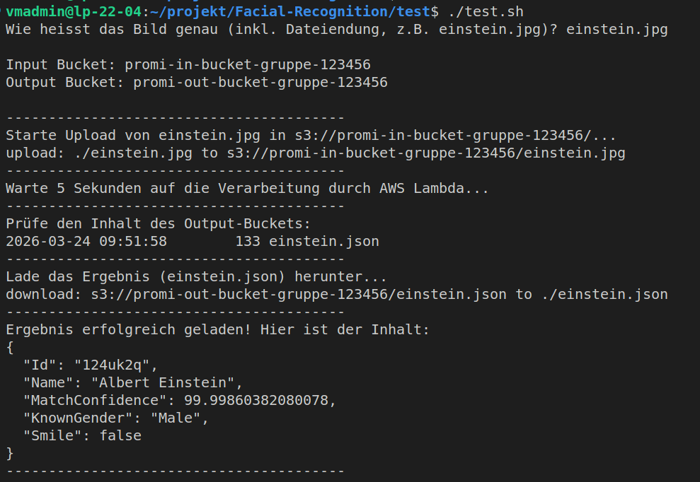
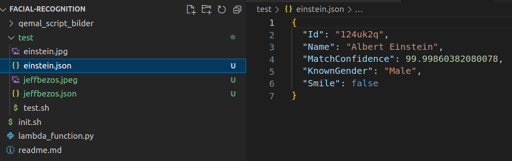
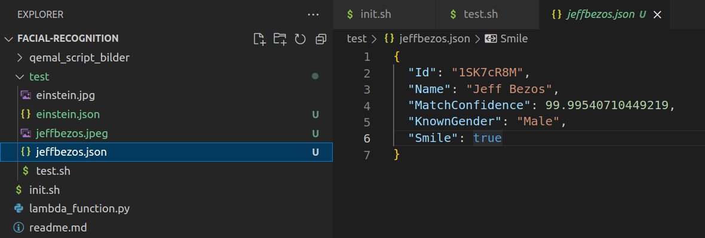
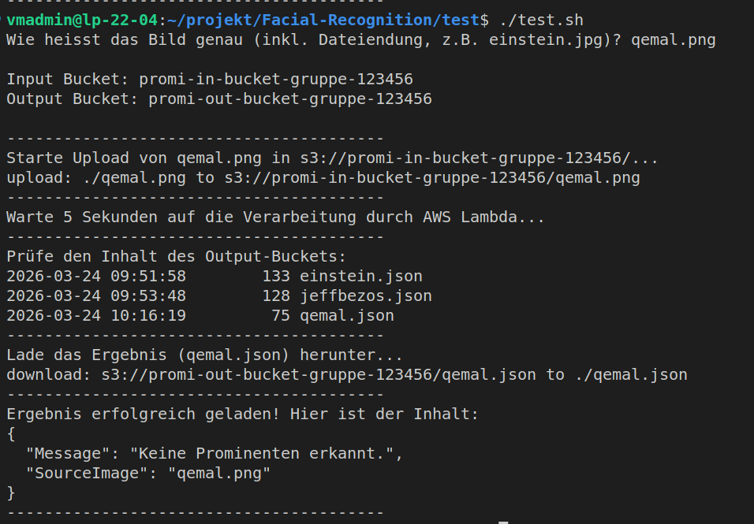
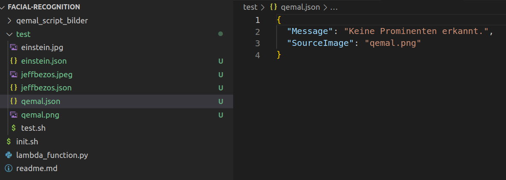

# Dokumentation – FaceRecognition AWS Celebrity Recognition Service

> **Modul 346** – Cloudlösungen konzipieren und realisieren
> GBS St.Gallen | Projektarbeit 2026
> Gruppe: Aldin, Qemal, Dijar

---

## Inhaltsverzeichnis

1. [Projektbeschreibung](#1-projektbeschreibung)
2. [Architektur](#2-architektur)
3. [AWS-Komponenten](#3-aws-komponenten)
4. [Setup / Inbetriebnahme](#4-setup--inbetriebnahme)
5. [Verwendung](#5-verwendung)
6. [Backend – Lambda-Funktion](#6-backend--lambda-funktion)
7. [Testprotokoll](#7-testprotokoll)
8. [Reflexion](#8-reflexion)

---

## 1. Projektbeschreibung

Der FaceRecognition-Service erkennt bekannte Persönlichkeiten auf Fotos vollautomatisiert mithilfe von AWS-Diensten. Ein Foto, das in den S3 In-Bucket hochgeladen wird, löst automatisch eine Lambda-Funktion aus, die das Bild über Amazon Rekognition analysiert. Das Ergebnis wird als JSON-Datei im S3 Out-Bucket abgelegt.

Der gesamte Service wird über ein einziges Shell-Script (`init.sh`) im AWS Learner-Lab bereitgestellt.

---

## 2. Architektur

```
┌─────────────┐     Upload      ┌─────────────────┐     Trigger      ┌──────────────────┐
│   Benutzer  │ ──────────────► │  S3 In-Bucket   │ ───────────────► │  Lambda-Funktion │
└─────────────┘                 └─────────────────┘                  └────────┬─────────┘
                                                                              │
                                                                   Rekognition API
                                                                              │
                                ┌─────────────────┐                 ┌────────▼──────────┐
                                │  S3 Out-Bucket  │ ◄────────────── │ Amazon Rekognition │
                                │  (JSON-Ergebnis)│   JSON speichern└───────────────────┘
                                └─────────────────┘
```

**Ablauf:**

1. Benutzer lädt ein Foto in den **S3 In-Bucket** hoch
2. Das Upload-Event triggert automatisch die **AWS Lambda-Funktion**
3. Die Lambda-Funktion ruft **Amazon Rekognition** (`recognize_celebrities`) auf
4. Das Erkennungsergebnis (Name, Konfidenz, Geschlecht, Lächeln) wird als **JSON-Datei** im **S3 Out-Bucket** gespeichert

---

## 3. AWS-Komponenten

| Komponente         | Name                             | Beschreibung                                                   |
|:------------------ |:-------------------------------- |:-------------------------------------------------------------- |
| S3 In-Bucket       | `promi-in-bucket-gruppe-123456`  | Empfängt die hochgeladenen Fotos                               |
| S3 Out-Bucket      | `promi-out-bucket-gruppe-123456` | Speichert die JSON-Ergebnisse der Analyse                      |
| Lambda-Funktion    | `PromiErkennerDemo`              | Python 3.12 – verarbeitet Fotos und ruft Rekognition auf       |
| Amazon Rekognition | `recognize_celebrities`          | AWS-KI-Dienst zur Erkennung bekannter Persönlichkeiten         |
| IAM-Rolle          | `LabRole`                        | Vordefinierte Learner-Lab-Rolle mit den nötigen Berechtigungen |

---

## 4. Setup / Inbetriebnahme

### Voraussetzungen

- AWS Learner-Lab gestartet und aktiv
- AWS CLI installiert und konfiguriert (`aws configure`)
- Bash-Shell (Linux, macOS oder WSL unter Windows)
- Zugangsdaten aus dem Learner-Lab (`AWS Access Key ID`, `Secret Access Key`, `Session Token`)

### AWS CLI konfigurieren

```bash
aws configure
```

Folgende Werte aus dem Learner-Lab eintragen:

| Feld                  | Wert                         |
|:--------------------- |:---------------------------- |
| AWS Access Key ID     | `<aus Learner-Lab kopieren>` |
| AWS Secret Access Key | `<aus Learner-Lab kopieren>` |
| Default region name   | `us-east-1`                  |
| Default output format | `json`                       |

> **Hinweis:** Der Session Token muss zusätzlich manuell in `~/.aws/credentials` eingetragen werden:
> 
> ```
> aws_session_token = <SESSION_TOKEN>
> ```

### Init-Script ausführen

Das Script `init.sh` erstellt alle benötigten AWS-Komponenten vollautomatisiert:

```bash
# Repository klonen
git clone <repository-url>
cd <repository-ordner>

# Script ausführbar machen und starten
chmod +x init.sh
./init.sh
```

Das Script führt folgende Schritte aus:

1. Erstellt den S3 In-Bucket (falls nicht vorhanden)
2. Erstellt den S3 Out-Bucket (falls nicht vorhanden)
3. Holt die ARN der `LabRole`
4. Verpackt `lambda_function.py` als ZIP
5. Erstellt (oder aktualisiert) die Lambda-Funktion
6. Setzt die S3-Trigger-Berechtigung
7. Konfiguriert die Event-Benachrichtigung am In-Bucket
8. Räumt temporäre Dateien auf

**Beispielausgabe nach erfolgreichem Setup:**

```
==========================================
✅ SETUP ERFOLGREICH ABGESCHLOSSEN!
Verwendete Komponenten:
- In-Bucket:  promi-in-bucket-gruppe-123456
- Out-Bucket: promi-out-bucket-gruppe-123456
- IAM-Rolle:  LabRole
- Lambda:     PromiErkennerDemo
==========================================
```

> **Hinweis:** Die Komponenten-Namen können direkt in den Variablen am Anfang von `init.sh` angepasst werden (`IN_BUCKET`, `OUT_BUCKET`, `LAMBDA_NAME`).

---

## 5. Verwendung

### Foto hochladen und Ergebnis abrufen

Mit dem Test-Script (`test/test.sh`) kann der Service direkt getestet werden:

```bash
cd test
chmod +x test.sh
./test.sh
```

Das Script fragt nach dem Dateinamen des Fotos, lädt es hoch, wartet auf die Verarbeitung und zeigt das JSON-Ergebnis an.

### Manueller Upload via AWS CLI

```bash
aws s3 cp einstein.jpg s3://promi-in-bucket-gruppe-123456/
```

### Ergebnis manuell abrufen

```bash
aws s3 cp s3://promi-out-bucket-gruppe-123456/einstein.json .
cat einstein.json
```

### Beispiel JSON-Ausgabe

```json
{
  "Id": "124uk2q",
  "Name": "Albert Einstein",
  "MatchConfidence": 99.99860382080078,
  "KnownGender": "Male",
  "Smile": false
}
```

Wird keine bekannte Person erkannt, lautet die Ausgabe:

```json
{
  "Message": "Keine Prominenten erkannt.",
  "SourceImage": "qemal.png"
}
```

---

## 6. Backend – Lambda-Funktion

Die Lambda-Funktion (`lambda_function.py`) ist in Python 3.12 geschrieben und verwendet `boto3` für die Kommunikation mit AWS-Diensten.

### Ablauf

1. **Event lesen** – Bucket-Name und Dateiname werden aus dem S3-Event extrahiert
2. **Rekognition aufrufen** – `recognize_celebrities` analysiert das Bild direkt aus S3
3. **Ergebnis auswerten** – Erster Treffer wird ausgelesen (Name, Konfidenz, Geschlecht, Lächeln)
4. **JSON speichern** – Ergebnis wird unter demselben Dateinamen (mit `.json`-Endung) im Out-Bucket abgelegt

### Umgebungsvariablen

| Variable          | Beschreibung                                 |
|:----------------- |:-------------------------------------------- |
| `OUT_BUCKET_NAME` | Name des S3 Out-Buckets für die JSON-Ausgabe |

### Fehlerbehandlung

Die Funktion enthält eine mehrstufige Fehlerbehandlung:

- Fehler beim Rekognition-Aufruf werden geloggt und weitergeworfen
- Fehler beim Speichern im Out-Bucket werden separat behandelt
- Unerwartete Fehler geben HTTP 500 mit Fehlermeldung zurück

---

## 7. Testprotokoll

### Testumgebung

| Eigenschaft    | Wert                        |
|:-------------- |:--------------------------- |
| AWS Region     | `us-east-1`                 |
| Lambda Runtime | Python 3.12                 |
| Testdatum      | 24.03.2026                  |
| Testperson     | Dijar                       |
| Testmaschine   | `vmadmin@lp-22-04` (Ubuntu) |

---

### Testfall 1 – Bekannte Persönlichkeit (Albert Einstein)

| Feld          | Inhalt                                          |
|:------------- |:----------------------------------------------- |
| **Ziel**      | Rekognition erkennt Albert Einstein korrekt     |
| **Eingabe**   | `einstein.jpg` → Upload via `test.sh`           |
| **Erwartung** | JSON mit Name "Albert Einstein", hohe Konfidenz |
| **Ergebnis**  | ✅ Erfolgreich                                   |
| **Konfidenz** | 99.9986%                                        |

**Screenshot – test.sh Ausführung (Upload & Ergebnis):**



**Screenshot – einstein.json in VS Code:**



**Fazit:** Die Erkennung funktioniert einwandfrei. Albert Einstein wird mit einer Konfidenz von nahezu 100% korrekt identifiziert. Die JSON-Datei wird automatisch im Out-Bucket abgelegt und ist sofort abrufbar.

---

### Testfall 2 – Bekannte Persönlichkeit (Jeff Bezos)

| Feld          | Inhalt                                     |
|:------------- |:------------------------------------------ |
| **Ziel**      | Rekognition erkennt Jeff Bezos korrekt     |
| **Eingabe**   | `jeffbezos.jpeg` → Upload via `test.sh`    |
| **Erwartung** | JSON mit Name "Jeff Bezos", hohe Konfidenz |
| **Ergebnis**  | ✅ Erfolgreich                              |
| **Konfidenz** | 99.9954%                                   |

**Screenshot – jeffbezos.json in VS Code:**



**Fazit:** Jeff Bezos wird zuverlässig erkannt. Das Feld `Smile: true` zeigt, dass auch Gesichtsmerkmale korrekt ausgelesen und ausgegeben werden.

---

### Testfall 3 – Unbekannte Person (Negativtest)

| Feld          | Inhalt                                       |
|:------------- |:-------------------------------------------- |
| **Ziel**      | Service behandelt unbekannte Person korrekt  |
| **Eingabe**   | `qemal.png` → Upload via `test.sh`           |
| **Erwartung** | JSON mit Meldung "Keine Prominenten erkannt" |
| **Ergebnis**  | ✅ Erfolgreich                                |

**Screenshot – test.sh Ausführung (Negativtest):**



**Screenshot – qemal.json in VS Code:**



**Fazit:** Der Negativtest bestätigt, dass der Service unbekannte Personen korrekt behandelt. Anstatt abzustürzen, liefert die Lambda-Funktion eine strukturierte JSON-Antwort mit einer klaren Fehlermeldung. Im Out-Bucket sind nach den drei Tests alle drei JSON-Dateien sauber aufgelistet (sichtbar im Terminal-Screenshot).

---

### Zusammenfassung

| #     | Testfall                        | Testdatum  | Testperson | Ergebnis    |
|:----- |:------------------------------- |:---------- |:---------- |:----------- |
| TF-01 | Erkennung Albert Einstein       | 24.03.2026 | Dijar      | ✅ Bestanden |
| TF-02 | Erkennung Jeff Bezos            | 24.03.2026 | Dijar      | ✅ Bestanden |
| TF-03 | Negativtest (unbekannte Person) | 24.03.2026 | Dijar      | ✅ Bestanden |

Alle Testfälle wurden erfolgreich durchgeführt. Der Service verhält sich in allen getesteten Szenarien wie erwartet.

---

## 8. Reflexion

### Aldin – Backend Developer

Ich war am Anfang etwas unsicher wegen der Lambda-Funktion, weil ich noch nie direkt mit der Rekognition API gearbeitet hatte. Aber es hat eigentlich gut geklappt. Die Funktion hat beim ersten richtigen Test sofort funktioniert, was mich selbst überrascht hat. Die boto3 Dokumentation hat mir dabei sehr geholfen.
Was mich am Anfang etwas aufgehalten hat waren die IAM Berechtigungen. Im Learner-Lab kann man nicht einfach alles selbst einstellen und ich musste erst verstehen wie die LabRole funktioniert und welche Rechte Lambda braucht um auf S3 und Rekognition zugreifen zu können. Das hat etwas Zeit gekostet aber am Ende hat es funktioniert.
Aus dem Unterricht hatte ich schon eine Vorstellung von Lambda und S3 aber wie man das alles zusammen zum Laufen bringt war neu für mich. Das war das Wertvollste was ich mitgenommen habe. Beim nächsten Projekt würde ich früher mit dem Testen anfangen und nicht erst warten bis alles fertig ist.

---

### Qemal – Cloud Engineer

Das Bauen der Infrastruktur lief eigentlich fast perfekt. Das init.sh Script war relativ schnell fertig weil ich die AWS CLI Befehle aus dem Unterricht schon kannte und wusste wie man die einzelnen Komponenten zusammenhängt. Es war ein gutes Gefühl zu sehen wie mit einem einzigen Befehl alles automatisch aufgebaut wird.
Ein Problem hatte ich aber mit den Bucket Namen. Ich hatte zuerst eine zufällige ID am Ende des Namens eingefügt damit die Buckets eindeutig sind. Das war aber keine gute Idee weil das Script dann bei jedem Durchlauf andere Namen generiert hat und die Komponenten sich nicht mehr gefunden haben. Ich habe das dann geändert auf feste Namen ohne zufällige ID und danach hat alles wieder einwandfrei funktioniert.
Schwieriger war es am Anfang auch mit den IAM Berechtigungen. Gerade der Teil wo Lambda die Erlaubnis braucht um vom S3 Bucket getriggert zu werden hat mich etwas Zeit gekostet. Man findet das nicht sofort in der Dokumentation und muss ein bisschen herumprobieren bis es passt.
Da Dijar krank war habe ich zusätzlich noch die Testprotokolle übernommen. Die Tests selbst liefen dann alle sehr gut und ohne Probleme was gezeigt hat dass die Infrastruktur sauber aufgebaut war. Beim nächsten Projekt würde ich von Anfang an auf feste, klar benannte Variablen setzen und nicht versuchen etwas zu automatisieren was dann mehr Probleme macht als es löst.

---

### Dijar – Scrum Master & QA

Ich war leider während eines Teils des Projekts krank und konnte deshalb nicht alles so umsetzen wie geplant. Qemal hat in dieser Zeit die Testprotokolle übernommen was ich ihm sehr danke. Mein Hauptbeitrag war die Dokumentation aufzusetzen und zu strukturieren.
Die Dokumentation hat gut funktioniert. Markdown ist wenn man sich mal daran gewöhnt hat wirklich praktisch und die Struktur mit README und DOKUMENTATION war von Anfang an klar.
Was ich mitgenommen habe ist dass man im Team flexibel sein muss wenn etwas nicht nach Plan läuft. Beim nächsten Projekt würde ich darauf achten früher zu kommunizieren wenn man ausfällt damit das Team mehr Zeit hat sich anzupassen.
