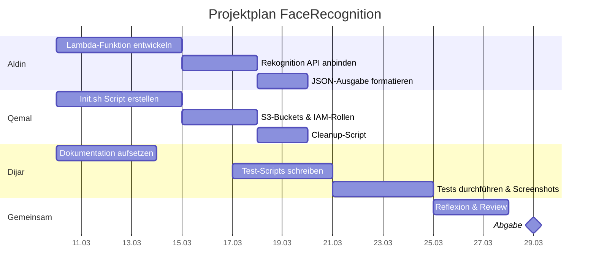

# FaceRecognition – AWS Celebrity Recognition Service
 
> **Modul 346** – Cloudlösungen konzipieren und realisieren  
> GBS St.Gallen | Projektarbeit 2026
 
---
 
## Projektbeschreibung
 
Ein Cloud-basierter Service, der bekannte Persönlichkeiten auf Fotos automatisch erkennt. Die Analyse erfolgt vollautomatisiert über AWS-Dienste im Learner-Lab.
 
---
 
## Anforderungen
 
1. **Cloud Service zur Gesichtserkennung**  
   Ein FaceRecognition-Service bestehend aus zwei S3-Buckets (In/Out), einer AWS Lambda-Funktion und Amazon Rekognition. Fotos, die in den In-Bucket hochgeladen werden, lösen automatisch die Erkennung aus. Das Ergebnis wird als JSON-Datei im Out-Bucket abgelegt.
 
2. **Vollautomatisierte Bereitstellung im AWS Learner-Lab**  
   Sämtliche AWS-Komponenten (S3-Buckets, Lambda-Funktion, IAM-Rollen) werden durch Ausführung eines einzigen Scripts (`Init.sh`) automatisch erstellt und konfiguriert.
 
3. **Versionierung und Verwaltung im Git-Repository**  
   Alle Dateien – Scripts, Lambda-Code, Konfiguration und Dokumentation – sind in einem Git-Repository versioniert. Die Commit-History zeigt nachvollziehbar, wer wann welche Änderungen vorgenommen hat.
 
4. **Dokumentation als Markdown**  
   Die gesamte Dokumentation ist in Markdown verfasst. Sie beschreibt den Aufbau des Services, die Inbetriebnahme und die Verwendung. Einstiegspunkt ist diese `README.md`, die ausführliche Dokumentation befindet sich in der [`DOKUMENTATION.md`](DOKUMENTATION.md).
 
5. **Testdurchführung und Protokollierung**  
   Der Service wird systematisch getestet. Alle Testfälle sind dokumentiert und mittels Screenshots protokolliert. Die Testprotokolle sind Teil der Dokumentation.
 
---
 
## Aufgabenverteilung
 
| Rolle                 | Mitglied | Aufgaben                                                                                                                                         |
|:--------------------- |:-------- |:------------------------------------------------------------------------------------------------------------------------------------------------ |
| **Backend Developer** | Aldin    | Programmierung der AWS Lambda-Funktion, API-Anbindung an Amazon Rekognition, Formatierung der JSON-Ausgabedatei                                  |
| **Cloud Engineer**    | Qemal    | Infrastruktur-Automatisierung (`Init.sh`), Erstellen der S3-Buckets und IAM-Rollen im Learner-Lab                                                |
| **Scrum Master & QA** | Dijar    | Erstellung und Pflege der Markdown-Dokumentation, Schreiben der Test-Scripts, Durchführung der manuellen Tests inkl. Screenshots und Protokollen |
 
---
 
## Zeitplan
 

 
---
 
## Abgabe
 
|                            |                                   |
|:-------------------------- |:--------------------------------- |
| **Abgabedatum**            | Sonntag, 29. März 2026, 23:59 Uhr |
| **Repository-Zugriff für** | `SilvioDallAcqua` (GitHub)        |
| **Abgabe via**             | Teams-Nachricht                   |
